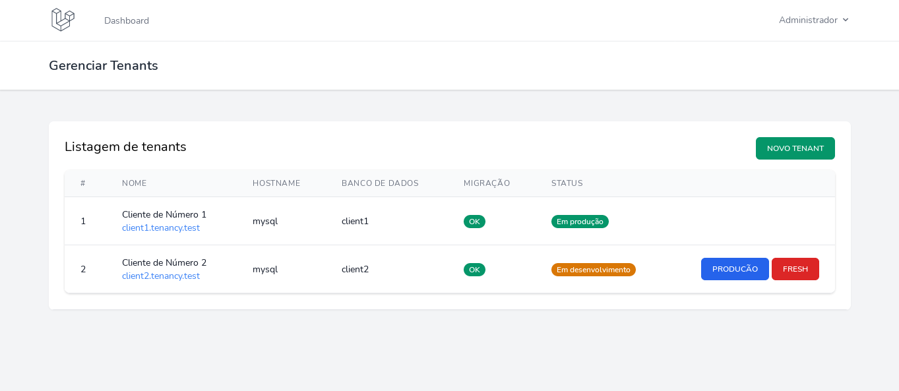
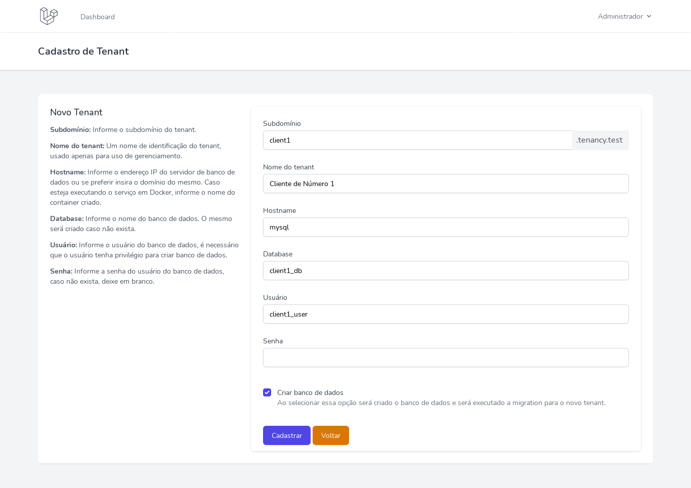

# Multitenancy

Painel de gerenciamento de sistemas multitenancy e multidatabase. Faça todo o gerenciamento desde a criação do banco de dados e monitoramento.

Esse pacote foi desenvolvido para ser um starter kit de um projeto Multitenancy e Multidatabase. Não utilize em um projeto em andamento.

> Pacote em desenvolvimento.

## Requisitos

Para que funcione corretamente, será necessário configurar 3 domínios para nossa aplicação, são eles:

1. master.tenancy.test (dmonínio utilizado para gerenciar os tenants)
2. client1.tenancy.test
3. client2.tenancy.test

Para isso, edite seu arquivo `hosts` localizado em `/etc/hosts` no caso do Linux. Adicione as seguintes linhas no final do arquivo:

```
127.0.0.1   master.tenancy.test
127.0.0.1   client1.tenancy.test
127.0.0.1   client2.tenancy.test
```

Agora quando você acessar pelo seu navegador a url `master.tenancy.test` será redirecionado para a porta 80 da sua máquina local, onde estará executando sua aplicação Laravel.

## Instalando o Laravel

Instale o laravel.

```bash
composer create-project laravel/laravel multitenancy
```

O Laravel 8 vem com o pacote Laravel Sail já instalado, sendo necessário apenas executar um comando para publicar o `docker-compose.yml` na raiz do projeto. Execute o seguinte comando para isso:

```
php artisan sail:install

aristides ~/Projetos/multitenancy $ php artisan sail:install

 Which services would you like to install? [mysql]:
  [0] mysql
  [1] pgsql
  [2] redis
  [3] selenium
  [4] mailhog
  [5] meilisearch
> 0
```

Escolha o banco de Dados Mysql [0].

Será gerado o arquivo `docker-compose.yml` na raiz do projeto, substitue o mesmo pelo conteúdo abaixo:

```yml
# For more information: https://laravel.com/docs/sail
version: '3'
services:
  app:
    build:
      context: ./vendor/laravel/sail/runtimes/8.0
      dockerfile: Dockerfile
      args:
        WWWGROUP: '1000'
    image: sail-8.0/app
    ports:
      - '${APP_PORT:-80}:80'
    environment:
      WWWUSER: '1000'
      LARAVEL_SAIL: 1
    volumes:
      - '.:/var/www/html'
    networks:
      - tenancy
    depends_on:
      - mysql

  mysql:
    image: 'mysql:5.7'
    ports:
      - '${FORWARD_DB_PORT:-3307}:3306'
    environment:
      MYSQL_ROOT_PASSWORD: '${DB_PASSWORD}'
      MYSQL_DATABASE: '${DB_DATABASE}'
      MYSQL_USER: '${DB_USERNAME}'
      MYSQL_PASSWORD: '${DB_PASSWORD}'
    volumes:
      - 'tenancydb:/var/lib/mysql'
    networks:
      - tenancy

networks:
  tenancy:
    driver: bridge

volumes:
  tenancydb:
    driver: local
```

Altere no arquivo `.env` a conexão com o banco de dados e deixe da seguinte forma.

```yml
DB_CONNECTION=mysql
DB_HOST=mysql
DB_PORT=3306
DB_DATABASE=laravel
DB_USERNAME=root
DB_PASSWORD=root
```

Execute o docker compose e aguarde a criação dos containers:

```
./vendor/bin/sail up -d
```

Acesse seu container da aplicação:

```
docker-compose exec app bash
su - sail 
cd /var/www/html
```

## Instalando o pacote Multitenancy

Dentro do container app, instale o pacote Multitenancy via composer:

```bash
composer require aristidesneto/multitenancy
```

### Configuração Tenant

É necessário criar uma nova conexão que será utilizada pelos tenants. Para isso abra o arquivo `config/database.php` e copie a conexão abaixo e cole logo apó a conexão atual `mysql`.

```php
  'tenant' => [
      'driver' => 'mysql',
      'url' => env('DATABASE_URL'),
      'host' => env('DB_HOST', '127.0.0.1'),
      'port' => env('DB_PORT', '3306'),
      'database' => env('DB_DATABASE', 'forge'),
      'username' => env('DB_USERNAME', 'forge'),
      'password' => env('DB_PASSWORD', ''),
      'unix_socket' => env('DB_SOCKET', ''),
      'charset' => 'utf8mb4',
      'collation' => 'utf8mb4_unicode_ci',
      'prefix' => '',
      'prefix_indexes' => true,
      'strict' => true,
      'engine' => null,
      'options' => extension_loaded('pdo_mysql') ? array_filter([
          PDO::MYSQL_ATTR_SSL_CA => env('MYSQL_ATTR_SSL_CA'),
      ]) : [],
  ],
```

### Comando Install

Para finalizar a instalação é necessário executar o comando:

```bash
php artisan multitenancy:install
```

### Requisitos do pacote

Um dos requisitos do pacote é o Laravel Breeze. Ao executar o comando acima será instalado o Laravel Breeze e todo seus arquivos referentes a autenticação.


## Uso

Após a instalação finalizar com sucesso acesse `http://master.tenancy.test` e clique no menu para fazer login. Utilize os dados de acesso abaixo:

```bash
E-mail: admin@admin.com
Senha: password
```

### Configurações para antes de cadastrar um Tenant

Quando um Tenant é cadastrado, suas informações como dados de login ao banco de dados é armazenado na tabela `tenants` da aplicação, nesse exemplo no banco `laravel`.

Por segurança, a senha dos usuários Tenants do banco Mysql pode ser salva no arquivo `.env` seguindo a nomeclatura:

```
CLIENT1_PASSWORD=password_client1
CLIENT2_PASSWORD=password_client2
```

Onde o `CLIENT1` é o nome do banco de dados que será utilizado para o Tenant, em seguida use `_PASSWORD`.

Caso essas informações não seja informada no `.env`, o sistema irá buscar na tabela `tenants` os dados de login e senha do banco referente ao Tenant.

## Cadastrando Tenants

Após o login, você poderá gerenciar os tenants. É possível cadastrar e se necessário zerar o banco de dados do tenant, opção essa que somente enquanto estiver em desenvolvimento.

Tela de Gerenciamento de Tenants:



Tela de Cadastro de Tenant:



### Como cadastrar um Tenant

Veja como você deverá cadastrar um Tenant:

1. Subdomínio: Informe uma url válida de subdomínio, para ambiente de desenvolvimento crie entrada para o seu arquivo hosts.
2. Nome do Tenant: Um nome de identificação do tenant, usado apenas para uso de gerenciamento.
3. Hostname: Informe o endereço IP do servidor de banco de dados ou se preferir insira o domínio do mesmo. Caso esteja executando o serviço em Docker, informe o nome do container criado.
4. Database: Informe o nome do banco de dados. O mesmo será criado caso não exista. 
5. Usuário: Informe o usuário do banco de dados, esse usuário será criado se a opção de criar database estiver marcado.
6. Senha: Por motivos de segurança, armazena a senha no arquivo `.env` como explicado mais acima. Caso queira salvar no banco de dados, basta informar a senha (será salva em texto puro).

Após cadastrar um tenant, na listagem clique sobre a URL disponível. Irá abrir uma nova aba com a URL criada, utilize os dados abaixo para realizar login:

```bash
E-mail: admin@tenant.com
Senha: password
```


## Teste

```bash
composer test
```


## Contribuição

Por favor veja CONTRIBUINDO para mais detalhes.


## Créditos

- [Arisides Neto](https://github.com/aristidesneto)
- [Todos](../../contributors)

## Licença


MIT License (MIT). Por favor veja Licença para mais informações.
